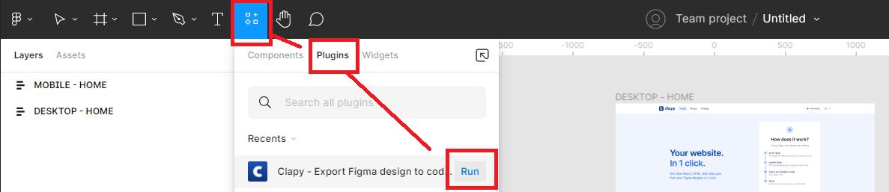

# Generate code with Clapy

Ready to get the code of your component? 🤩

Let's see how to run the plugin and generate the React code.

### 1. Download the plugin on Figma


To download Clapy, visit our Figma community page by following this link: [https://www.figma.com/community/plugin/1083031796594968801](https://www.figma.com/community/plugin/1083031796594968801)


Once you are on the Figma community page, click on the <mark style="background-color:blue;">Try it out</mark> button on the top-right corner

.png>)

### 2. Load the plugin in a file

Open a Figma file containing the design you want to code.


**Important:** You need to have the **editor role** in the Figma file where you will use Clapy.&#x20;


If you are not an editor, ask someone with the `editor` role to click on the "share" button in the top-right corner of your file, and update the dropdown menus from `"Only people invited to this file > Can access"` to `"Only people with the link and password > Can edit"`.


A workaround is to duplicate the Figma file. As owner of the copy, you can open plugins. But you won't get updates from the original file. Don't use it in productivity workflows!


Once you have the editor rights, click on the `Resources` icon next to the `Text` icon, then open open the `Plugins` tab, hover the plugin Clapy and click <mark style="background-color:blue;">Run</mark> .

You can also load Clapy by right-clicking on the canvas of the file > Plugins > Clapy

.png>)

### 3. Sign up / sign in to Clapy in your browser

Let's set up your Clapy account to start using the plugin.

When clicking sign up or sign in, the plugin will open a tab in your browser, where you will be able to create your account or sign in.&#x20;

Once you are logged in, you can get back to Figma if it was not done automatically.

.png>)

After signing up, you will receive an email from [Auth0](https://auth0.com/) in order to validate your email address. Auth0 is our trusted partner for authentication.

### 4. Go go code 🚀

Once you are logged in to Clapy, you will land on a screen with a message prompting you to select an element in Figma.

.png>)

To generate the code, just select the outer frame of the design you want to code. You can preview your selection to make sure you will generate the code for the right element.

Once your element is selected -> just click the button <mark style="background-color:blue;">< Generate code ></mark> and... that's it! 🚀

.png>)

The plugin will start generating the code for you, and will publish it to a [Codesandbox](https://codesandbox.io/) to allow you to preview the result and get the code easily.


**Download as Zip:** You can download the code as a Zip folder **** if you don't want to publish it to Codesandbox. To do so, click on the dropdown "advanced options" and select "download to zip" before generating your code.


### 5. Preview and edit the code in Codesandbox

Let's generate the code of a Hero section of a page.

* Select the frame
* Click on < Generate code >
* Wait a few seconds for the plugin to generate the code&#x20;


The duration of the code generation depends on the number and size of the assets and the sub-components contained in the element you are generating.

If the code generation takes too much time and you cannot get the code, [contact us on our Discord](https://discord.gg/XJ4cb5EJPh) to see what we can do to optimize this.


Once the code is ready, you will see 3 buttons:&#x20;

* Live preview
* Edit code
* Generate more code

#### Live preview

Clicking on "Live preview" will open a browser tab where you will be able to see the result of your component in full width.

There, you can test the responsiveness of your element within the browser.


If the design is not responsive in Figma, it will unfortunately not be responsive in the code generated by Clapy. For better result, try using Figma's [auto-layout feature](../figma-basics/add-auto-layout-in-frames.md) on your designs.


#### Edit code

Clicking on "Edit code" will open a browser tab where you will be able to see the whole code structure of your React project, including:

* The app itself
* The components
* The assets

#### Generate more code

By clicking on this button, you will come back to the previous step (select a frame and generate code).

### Github integration

You will be able to get your code in a target repo via Github in the coming weeks.

Stay tuned on this update our Discord server: [https://discord.gg/qunGReFFqW](https://discord.gg/qunGReFFqW)

### Export history and Zip folder

We will soon release a log of all the code generated with Clapy, within the plugin.

This Export History will include:

* The time when the code was generated
* The type of export (Codesandbox or Zip download)
* A link to Codesandbox of the generated code, if this option was selected


**Important:** Clapy does not store the Zip folders generated with the plugin. They won't be available for download in the Export History.

