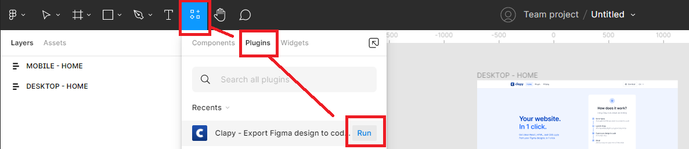

# Step 2: Load Clapy in your file


**Important:** You need to have the **editor role** in the Figma file where you will use Clapy.&#x20;


_If you are not an editor, ask someone with the `editor` role to click on the "share" button in the top-right corner of your file, and update the dropdown menus from `"Can access"` to `"Can edit"`._

A workaround is to duplicate the Figma file. As owner of the copy, you can open plugins. But you won't get updates from the original file. Don't use it in productivity workflows!

Once you have the editor rights, click on the `Resources` icon next to the `Text` icon, then open open the `Plugins` tab, hover the plugin Clapy and click <mark style="background-color:blue;">Run</mark> .

You can also load Clapy by right-clicking on the canvas of the file > Plugins > Clapy

.png>)

###
